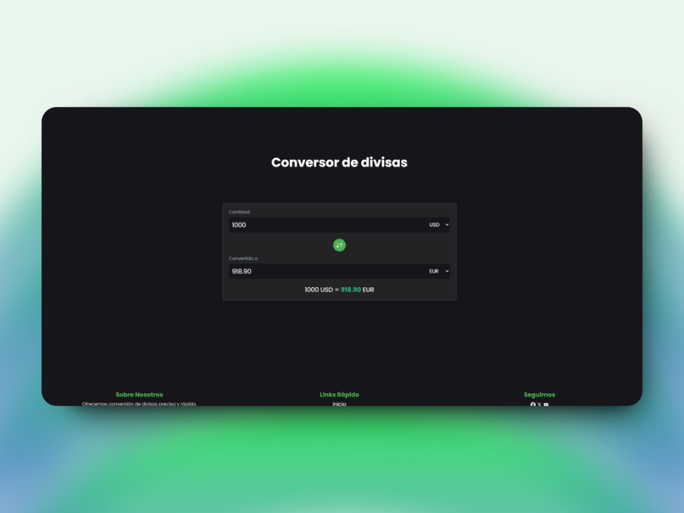

# Currency Converter

Este proyecto es un conversor de divisas sencillo basado en JavaScript que permite convertir montos entre diferentes monedas utilizando las tasas de cambio actuales. Las tasas de cambio se obtienen de la API [ExchangeRate-API](https://www.exchangerate-api.com/).

## Características

- Conversión de divisas entre más de 160 monedas.
- Intercambio de monedas con un solo clic.
- Actualización automática del monto convertido al cambiar la cantidad o las monedas de origen y destino.

## Capturas de pantalla



## Requisitos

Para que el conversor funcione correctamente, es necesario tener acceso a Internet para poder realizar las llamadas a la API y obtener las tasas de cambio actuales.

## Instalación

1. **Clonar el repositorio**:

   ```bash
   git clone https://github.com/alvarof260/cambiarYa
   cd cambiarYa
   ```

2. **Obtener una clave de API**:

   Regístrate en [ExchangeRate-API](https://www.exchangerate-api.com/) y obtén una clave de API gratuita.

3. **Configurar la URL de la API**:

   En el archivo JavaScript (`script.js`), reemplaza `API_URL` con la URL de la API y tu clave de API:

   ```javascript
   const API_URL = "https://v6.exchangerate-api.com/v6/TU_API_KEY/latest/USD";
   ```

## Uso

1. Abre el archivo `index.html` en un navegador web.
2. Ingresa el monto que deseas convertir.
3. Selecciona la divisa de origen y destino.
4. La conversión se realizará automáticamente y se mostrará debajo de los campos de entrada.

### Intercambiar Divisas

Presiona el botón de intercambio de monedas (↔️) para cambiar rápidamente la divisa de origen con la de destino.

## Estructura del Proyecto

```
cambiarYa/
│
├── assets/
│   ├── css/
│   │   ├── components/
│   │   │   ├── boton.css          # Estilos para botones.
│   │   │   ├── conversor.css       # Estilos específicos para el conversor de divisas.
│   │   │   ├── faq.css             # Estilos para la sección de preguntas frecuentes.
│   │   │   ├── footer.css          # Estilos para el pie de página.
│   │   │   ├── header.css          # Estilos para el encabezado.
│   │   │   ├── hero.css            # Estilos para la sección hero (principal).
│   │   │   ├── main.css            # Estilos generales del proyecto.
│   │   │   ├── normalize.css       # Restablece estilos predeterminados del navegador.
│   │   │   └── tipografia.css      # Estilos de tipografía.
│   │
│   └── js/
│       ├── hoverEffect.js          # Efectos de hover para elementos interactivos.
│       ├── main.js                 # Lógica principal del conversor.
│       └── navbar.js               # Funcionalidades de la barra de navegación.
│
├── .gitignore                      # Archivos y directorios ignorados por Git.
├── index.html                      # Archivo HTML principal.
├── package.json                    # Dependencias y configuración del proyecto.
└── README.md                       # Documentación del proyecto.

```

## Explicación del Código

### `initializeCurrency()`

Esta función inicializa el conversor cargando las tasas de cambio para la divisa base predeterminada (`USD`) y poblando los selectores de moneda con las opciones disponibles.

### `convertCurrency()`

Realiza la conversión de moneda tomando el valor de la cantidad ingresada, la divisa de origen y la de destino. Calcula el monto convertido y actualiza el DOM con el resultado.

```javascript
function convertCurrency() {
  const amountValue = parseFloat(amount.value);
  const fromCurrency = fromCurrencySelect.value;
  const toCurrency = toCurrencySelect.value;

  // Lógica de conversión
  const rate = currencyRatesCache[fromCurrency][toCurrency];
  const convertedAmount = (amountValue * rate).toFixed(2);

  converted.value = convertedAmount;
  conversionRate.innerHTML = `${amountValue} ${fromCurrency} = 
  <span class="conversion-rate-span">${convertedAmount}</span> ${toCurrency}`;
}
```

### `populateCurrencyOptions(currencyRates)`

Rellena los selectores de divisa (`fromCurrencySelect` y `toCurrencySelect`) con todas las monedas disponibles.

## Eventos

- **Intercambio de monedas**: el evento `click` del botón de intercambio cambia la divisa de origen con la de destino.
- **Cambio de cantidad o divisas**: cada cambio en el valor de cantidad o en las selecciones de divisas de origen y destino dispara una conversión automática.

## Ejemplo de Uso

1. Ingresar `1000` en el campo de cantidad.
2. Seleccionar `USD` como divisa de origen.
3. Seleccionar `EUR` como divisa de destino.
4. El resultado se muestra automáticamente como `1000 USD = 900.00 EUR` (dependiendo de la tasa de cambio actual).

## Licencia

Este proyecto está disponible bajo la licencia MIT. Consulta el archivo `LICENSE` para más información.

---

Este `README.md` proporciona una guía completa y fácil de seguir para tu proyecto de conversor de divisas. ¡Espero que te sea útil!
